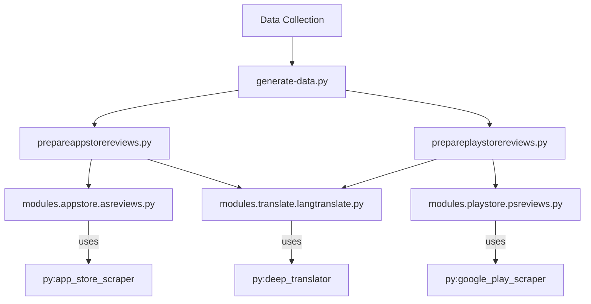
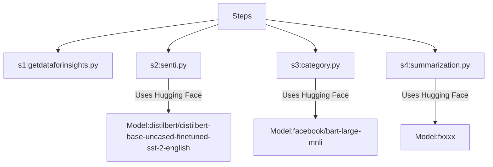

STEP 1: Generate Data

```mermaid
graph TD;
    A[Data Collection]-->B[generate-data.py];
    B-->C[prepareappstorereviews.py];
    C-->M1[modules.appstore.asreviews.py]--uses-->P1[py:app_store_scraper];
    C-->M2[modules.translate.langtranslate.py]--uses-->P3[py:deep_translator];
    B-->D[prepareplaystorereviews.py];
    D-->M3[modules.playstore.psreviews.py]--uses-->P2[py:google_play_scraper];
    D-->M2
    
```

STEP 2: Report Generation

```mermaid
graph TD;
A[Steps]
    S1[s1:getdataforinsights.py]
    S2[s2:senti.py]--Uses Hugging Face-->HF1[Model:distilbert/distilbert-base-uncased-finetuned-sst-2-english]
    S3[s3:category.py]--Uses Hugging Face-->HF2[Model:facebook/bart-large-mnli]
    S4[s4:summarization.py]--Uses Hugging Face-->HF3[Model:fxxxx]
    A-->S1
    A-->S2
    A-->S3
    A-->S4

```

